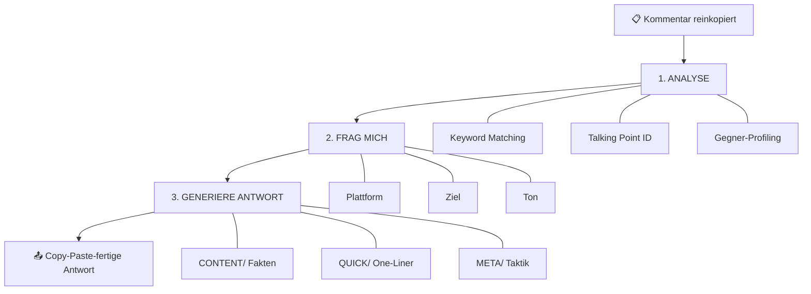
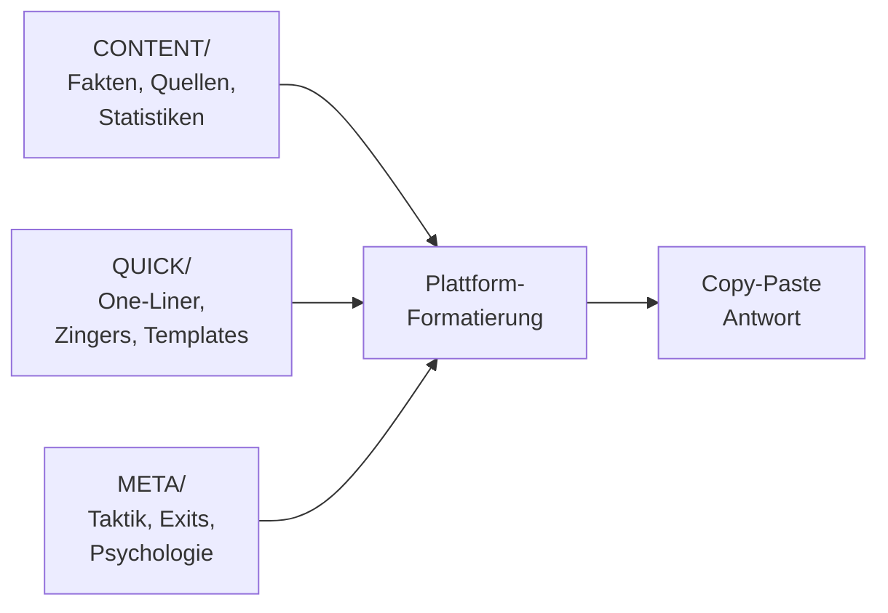

# Architektur: Was passiert wenn du einen Kommentar reinkopierst

> Vom Nazi-Kommentar zur Copy-Paste-Antwort in 3 Schritten.

---

## Übersicht



---

## Step 1: ANALYSE

Drei Dinge passieren gleichzeitig:

### A. Keyword Matching

[[../AUTOMATION/triggers.yaml|triggers.yaml]] mapped Keywords aus dem Kommentar auf Repo-Dateien.

| Keyword im Kommentar | Wird geroutet zu |
|----------------------|-----------------|
| "nazi", "faschist" | [[../CONTENT/01-parteien/afd-und-rechts#Höcke ist Faschist - Gerichtsurteil]] |
| "Lügenpresse" | Bot-Taktik / Delegitimierung |
| "beide Seiten" | [[../CONTENT/02-themen/false-equivalence#Gewaltstatistiken - Die Zahlen]] |
| "NATO versprochen" | [[../CONTENT/02-themen/russland-ukraine#NATO-Osterweiterung Mythos]] |

### B. Talking Point Identifikation

[[../INDEX|INDEX.md]] enthält die Schnellsuche-Tabelle. Jede Behauptung hat:
- Direkt-Link zur Widerlegung
- Schwierigkeitsrating: 🟢 EASY / 🟡 MEDIUM / 🔴 HARD

### C. Gegner-Profiling

Basierend auf [[techniques|META/techniques.md]]:

| Typ | Merkmale | Konsequenz |
|-----|----------|------------|
| 🤖 Bot | Junges Profil, Copy-Paste-Muster, hohe Frequenz | Antwort für Mitleser, nicht für den Bot |
| 🎭 Troll | Will provozieren, kein echtes Argument | Kurzer Konter oder Exit |
| 👤 Echter Gläubiger | Überzeugt, aber gesprächsbereit | Dialog möglich, Fakten + Empathie |

Erkennt Deflection-Taktiken: Whataboutism, Sealioning, Gish Gallop, Effort Shaming.

**Output von Step 1:**

```
🏷️ Erkannte Talking Points: [Liste]
🎭 Einschätzung: Bot / Troll / Echter Gläubiger / Unklar
🔄 Deflection-Taktik: [falls erkannt]
```

---

## Step 2: FRAG MICH

Maximal 3 Fragen (überspringbar mit Shortcut wie `"reddit, mitleser, scharf"`):

| Frage | Optionen | Beeinflusst |
|-------|----------|-------------|
| **Plattform?** | Reddit, Twitter/X, Facebook, Privat, Arbeit | Formatierung |
| **Ziel?** | Mitleser überzeugen, Person erreichen, Entlarven & Exit | Inhalt + Tiefe |
| **Ton?** | Sachlich mit Quellen, Scharf aber fair, Spöttisch/Zinger | Wortwahl |

Optional: **Länge?** (One-Liner / Kurz / Ausführlich)

---

## Step 3: GENERIERE ANTWORT

### Drei Content-Layer



| Layer | Ordner | Liefert |
|-------|--------|---------|
| Fakten | [[../CONTENT/|CONTENT/]] | Verifizierte Statistiken, Gerichtsurteile, Quellen |
| Quick Response | [[../QUICK/|QUICK/]] | Fertige Konter unter 30 Wörtern, Zinger, Templates |
| Taktik | [[techniques\|META/techniques]] | Bot-Erkennung, Gesprächsstrategie, Exit-Optionen |

### Plattform-Formatierung

| Plattform | Format |
|-----------|--------|
| Reddit | Markdown mit `>` Zitaten, **fett** für Key Points |
| Twitter/X | Max 280 Zeichen oder Thread (1/5, 2/5...) |
| Privat | Gesprächston, keine Links, freundlicher |

### Output-Format

```
[Copy-Paste-fertige Antwort]

📎 Verwendete Quellen aus dem Repo
🚪 Exit-Option (falls Loop erkennbar)
💡 Alternativer Ansatz
```

---

## Eskalations-Leiter

Wenn die Diskussion weitergeht:

| Level | Situation | Response | Quelle |
|-------|-----------|----------|--------|
| 1 | Echte Frage | Fakten + Quelle | CONTENT/ |
| 2 | Wiederholung | "Schon beantwortet. Neues Argument?" | [[../QUICK/one-liners]] |
| 3 | Deflection | "Willst du diskutieren oder propagieren?" | [[../QUICK/zinger-arsenal]] |
| 4 | Loop erkannt | "Das ist ein Script, keine Diskussion" | [[exits]] |
| 5 | Exit | "Mitleser haben die Quellen. Fertig." | [[exits]] |

---

## Shortcuts

Statt den 3-Step-Workflow zu durchlaufen:

| Shortcut | Ergebnis |
|----------|----------|
| `one-liner` | Nur ein kurzer Konter |
| `exit` | Exit-Strategie |
| `quellen` | Relevante Quellen aus dem Repo |
| `bot?` | Bot-Analyse des Kommentars |

---

## Design-Prinzip

> [!important] Für Mitleser, nicht für Bots
> Jede Antwort ist für die stillen Leser geschrieben, die den Thread mitlesen. Nicht für die Person, der du antwortest.
>
> Ein guter Exit mit Zusammenfassung > 20 Runden im Kreis.

---

## Datenfluss-Zusammenfassung

```
Kommentar
  │
  ├─→ triggers.yaml ──→ Keywords matchen ──→ CONTENT/ Dateien identifizieren
  ├─→ INDEX.md ────────→ Talking Points + Schwierigkeit nachschlagen
  └─→ techniques.md ──→ Bot/Troll/Mensch einschätzen
  │
  ▼
Kontext-Fragen (Plattform, Ziel, Ton)
  │
  ▼
Antwort generieren
  ├─→ CONTENT/ ──→ Fakten + Quellen
  ├─→ QUICK/ ───→ Fertige Konter
  └─→ META/ ────→ Taktik + Exit
  │
  ▼
Plattform-formatierte Copy-Paste Antwort
```
